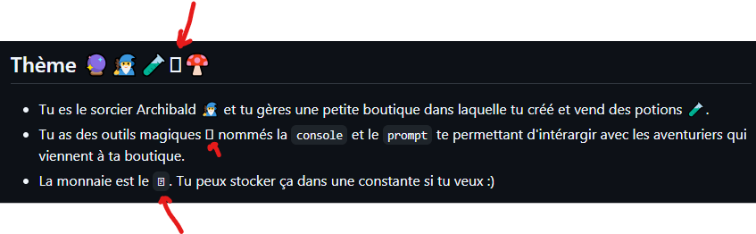

# Retour sur le TP

Il y a un problème de lisibilité avec les emojis, sur chrome impossible de voir la monnaie:


## Affichage conditionnel avec switch

Pour redemander le choix faire une boucle while ou dowhile, peut être le précisé dans l'énoncé.

## Vente de potions

Je n'ai pas trop compris cette parie, s'il a faux, pourquoi il fdevrait retenter sa chance, car on n'y gagne rien s'il retente.

```
2. Vendre une potion
  - Il peut essayer de vendre une des potions qu'il a dans l'inventaire (au même prix)
    - Pour cela, tu dois lui faire deviner un chiffre entre 1 et 5 (voir `Math.random`) 🎲
  - S'il a juste, tu lui rachete tout le stock de la potion en question (avec les mêmes règles de gestion que l'achat)
  - S'il a faux, tu peux lui dire de re-tenter sa chance 😈
```
